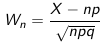
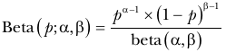

# **Proiect Tehnici de Simulare**

10\. Să se genereze prin două metode variabila Beta(0.25, 0.3). Să se
genereze prin două metode variabila binomială cu parametrii
citiţi de la tastatură.

 

## **Repartitia Binomiala**

Repartitia binomială este o repartitie de probabilitate discretă reprezentând numărul de succese intr-o secvență de n încercări Bernoulli (experimente da/nu) cu probabilitate de success p.

k - numarul de succese  
n - numarul de incercari  
p - probabilitatea de succes

### Media:  
μ = np

### Dispersia:  
$σ^2$ = np(1-p)

### Exemplu

Probabilitatea de a obtine de k ori cap dupa 3 aruncari de moneda:

 

### **Generarea repartitiei Binomiale**

1\. Metoda transformatei inverse  

2\. Teorema limită centrală

 

## **Repartitia Beta**

Repartitia Beta este o repartitie de probabilitate continua care descrie probabilitățile unui eveniment pentru care sunt date α rezultate favorabile și β rezultate nefavorabile.

p - probabilitatea de succes  
α - numarul de succese  
β - numarul de esecuri  

### Media:  
μ = $\frac{α}{α + β}$

### Dispersia:  
$σ^2$ = $\frac{αβ}{(α + β)^2 (α + β + 1)}$

### **Generarea repartitiei Beta**

Teorema:   
Fie 0 < a < 1, 0 < b < 1 şi U1 , U2 variabile aleatoare uniforme pe [0, 1] independente.  
Dacă  $V = U_1 ^ {1/a}$ , $T = U_2 ^ {1/a}$ , atunci repartiţia variabilei X = V / V + T condiţionată de V + T < 1 este Beta(a, b).