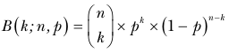
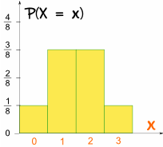

# Generare valori distributie Binomiala

Build proiect:
```bash
./mvnw clean package
```

Rulare:
```bash
java -jar target/distributie-binomiala-1.0-jar-with-dependencies.jar
```

<br>

## Distributia Binomiala

Distribuția binomială este o distribuție de probabilitate discretă reprezentând numărul de succese intr-o secvență de n încercări Bernoulli (experimente da/nu) cu probabilitate de success p.



k - numarul de succese  
n - numarul de incercari  
p - probabilitatea de succes

### Exemplu

Probabilitatea de a obtine de k ori cap dupa 3 aruncari de moneda:



### Media, dispersia si abaterea standard

Media:  
μ = np

Dispersia:  
σ^2 = np(1-p)

Abaterea standard:  
σ = √(np(1-p)) 